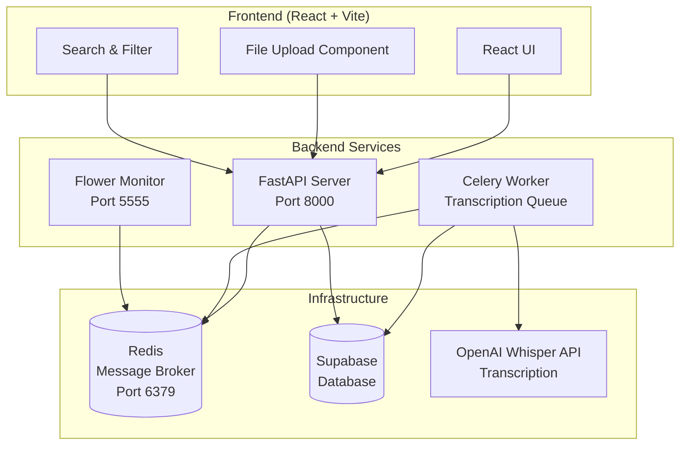

# Testimony Vault Scribe

A full-stack application for recording, uploading, and transcribing audio testimonies with automatic speech-to-text processing using OpenAI's Whisper API.

## 🏗️ Architecture Overview



## 📁 Directory Structure

```
testimony-vault-scribe/
├── backend/                    # Python FastAPI backend
│   ├── src/app/               # Main application code
│   │   ├── main.py           # FastAPI application
│   │   ├── tasks.py          # Celery tasks for transcription
│   │   ├── crud.py           # Database operations
│   │   ├── schemas.py        # Pydantic models
│   │   ├── deps.py           # Dependencies and configuration
│   │   └── utils.py          # Utility functions
│   ├── requirements.txt      # Python dependencies
│   ├── Dockerfile           # Backend container configuration
│   └── run_worker.py        # Development worker script
├── src/                      # React frontend source
│   ├── components/          # React components
│   ├── services/           # API service functions
│   ├── types/              # TypeScript type definitions
│   └── integrations/       # External service integrations
├── supabase/               # Supabase configuration and migrations
├── docker-compose.yml      # Multi-service container orchestration
├── package.json           # Frontend dependencies and scripts
└── .env                   # Environment variables (create this)
```

## 🚀 Quick Start

### Prerequisites

- **Node.js** (v18 or higher) - [Install with nvm](https://github.com/nvm-sh/nvm#installing-and-updating)
- **Docker & Docker Compose** - [Install Docker](https://docs.docker.com/get-docker/)
- **OpenAI API** account with credits
- **Supabase** project

### 1. Clone the Repository

```bash
git clone <YOUR_GIT_URL>
cd testimony-vault-scribe
```

### 2. Environment Configuration

Create a `.env` file in the root directory:

```env
# Redis Configuration (use 'redis' as hostname for Docker)
REDIS_URL=redis://redis:6379/0

# OpenAI Configuration
OPENAI_API_KEY=your_openai_api_key_here

# Directory where uploaded audio will be stored temporarily
AUDIO_UPLOAD_DIR=/shared/tmp

# Supabase Configuration
SUPABASE_URL=https://your-project.supabase.co
SUPABASE_KEY=your_supabase_anon_key

# Optional Celery Configuration
CELERY_LOG_LEVEL=info
SKIP_CLIENT_INIT=false
```

### 3. Install Frontend Dependencies

```bash
npm install
```

### 5. Start All Services

```bash
# Start backend services (Redis, API, Worker, Flower)
docker-compose up -d

# Start frontend development server
npm run dev
```

Uploaded audio files are stored in a shared Docker volume (`shared-data`) mounted
at `/shared` for both the API and worker containers.

## 🔧 Development Setup

### Backend Only (Local Development)

```bash
# Build and start all services
docker compose up --build -d

# Or start individual services:
# - Redis: docker compose up redis -d
# - FastAPI: docker compose up api -d
# - Celery: docker compose up worker -d

### Frontend Only

```bash
# Install dependencies
npm install

# Start development server
npm run dev

# Build for production
npm run build

# Preview production build
npm run preview
```

## 🌐 Service URLs

- **Frontend**: http://localhost:5173 (Vite dev server)
- **Backend API**: http://localhost:8000
- **API Documentation**: http://localhost:8000/docs
- **Celery Monitor (Flower)**: http://localhost:5555
- **Worker Statistics**: http://localhost:8000/worker/stats

## 📋 Required Environment Variables

| Variable | Description | Example |
|----------|-------------|---------|
| `REDIS_URL` | Redis connection string | `redis://redis:6379/0` |
| `OPENAI_API_KEY` | OpenAI API key for Whisper | `sk-...` |
| `SUPABASE_URL` | Supabase project URL | `https://xyz.supabase.co` |
| `SUPABASE_KEY` | Supabase anonymous key | `eyJ...` |
| `AUDIO_UPLOAD_DIR` | Shared directory for temporary audio files | `/shared/tmp` |
| `CELERY_LOG_LEVEL` | Worker logging level (optional) | `info` |
| `SKIP_CLIENT_INIT` | Skip heavy client initialization (optional) | `false` |

## 🔄 How It Works

1. **Upload**: Users upload MP3 audio files through the React frontend
2. **Storage**: Files are saved temporarily on a shared volume
3. **Database**: Testimony metadata is stored in Supabase with `transcript_status: "pending"`
4. **Queue**: A Celery task is queued for transcription processing
5. **Processing**: Celery worker downloads audio and sends to OpenAI Whisper API
6. **Update**: Transcript is saved to database with `transcript_status: "completed"`
7. **Search**: Users can search and filter testimonies by content, church, tags, etc.

## 🛠️ Technology Stack

### Frontend
- **React 18** - UI framework
- **TypeScript** - Type safety
- **Vite** - Build tool and dev server
- **Tailwind CSS** - Styling
- **shadcn/ui** - UI component library
- **React Query** - Data fetching and caching
- **React Hook Form** - Form management
- **React Router** - Client-side routing

### Backend
- **FastAPI** - Python web framework
- **Celery** - Asynchronous task queue
- **Redis** - Message broker and cache
- **Supabase** - PostgreSQL database
- **OpenAI Whisper API** - Speech-to-text transcription
- **Pydantic** - Data validation
- **Uvicorn** - ASGI server

### Infrastructure
- **Docker & Docker Compose** - Containerization
- **Flower** - Celery monitoring
- **PostgreSQL** - Database (via Supabase)

## 🧠 Semantic Search

Set `OPENAI_API_KEY`, `SUPABASE_URL` and `SUPABASE_KEY`, then run:

```bash
python -m semantic.index_testimonies
```

## 📊 Monitoring & Debugging

### Check Service Status
```bash
# View all services
docker compose ps

# View logs
docker compose logs backend
docker compose logs worker
docker compose logs redis

# Monitor worker in real-time
docker compose logs -f worker
```

### Flower Monitoring Dashboard
Visit http://localhost:5555 to monitor:
- Active/completed/failed tasks
- Worker statistics and performance
- Task details and results
- Real-time updates

### API Health Checks
- Worker stats: `GET http://localhost:8000/worker/stats`
- Task status: `GET http://localhost:8000/tasks/{task_id}`
- API docs: http://localhost:8000/docs

## 🚨 Troubleshooting

### Common Issues

**Worker not processing tasks:**
```bash
# Check worker logs
docker-compose logs worker

# Restart worker
docker-compose restart worker
```

**Frontend can't connect to backend:**
- Ensure backend is running on port 8000
- Check CORS configuration in `backend/src/app/main.py`

**Transcription failures:**
- Verify OpenAI API key and credits
- Ensure audio files are in supported format (MP3)

**Database connection issues:**
- Verify Supabase URL and key
- Check network connectivity
- Review Supabase project settings

## 📝 API Endpoints

### Upload Testimony
```http
POST /testimonies
Content-Type: multipart/form-data

file: audio_file.mp3
church_id: optional_church_id
recorded_at: optional_iso_date
```

### Search Testimonies
```http
GET /testimonies/search/{query}?church_id=optional&transcript_status=optional
```

### Get Testimonies (Paginated)
```http
GET /testimonies?page=1&size=50&church_id=optional&transcript_status=optional
```

### Check Task Status
```http
GET /tasks/{task_id}
```

## 🤝 Contributing

1. Fork the repository
2. Create a feature branch: `git checkout -b feature-name`
3. Make your changes
4. Run tests: `npm run lint` (frontend) and `pytest` (backend)
5. Commit changes: `git commit -m "Description"`
6. Push to branch: `git push origin feature-name`
7. Create a Pull Request

## 📄 License

This project is licensed under the MIT License - see the LICENSE file for details.

## 🔗 Links

- **Lovable Project**: https://lovable.dev/projects/8531b9d6-7169-45e7-81f6-10b6c059ee9a
- **Supabase**: https://supabase.com
- **OpenAI Whisper**: https://openai.com/research/whisper
